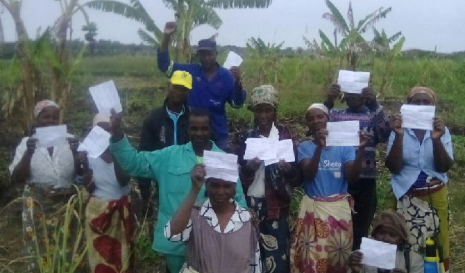
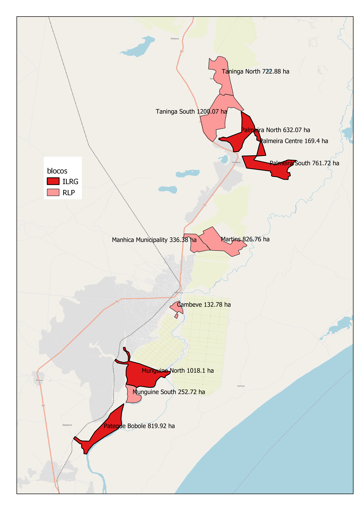

# Introdução

## **Sumário Executivo**

O propósito do programa de Governança Integrada de Terra e Recursos \(ILRG\), financiado pela USAID, é desenvolver e implementar intervenções direccionadas para remover as barreiras relacionadas à posse de terra, para alcançar objectivos prioritários de desenvolvimento, tais como prevenir e mitigar conflitos, combater o extremismo violento, alcançar empoderamento económico, promoção de crescimento económico inclusivo, aumento da produtividade agrícola e segurança alimentar, e fortalecimento da conservação da biodiversidade e gestão sustentável dos recursos naturais. Em Moçambique, o ILRG procura identificar modelos de investimento em terra que proporcionem benefícios para as comunidades locais e, ao mesmo tempo, sejam rentáveis para os investidores.

O ILRG aproveitará os trabalhos anteriormente realizados no âmbito do Piloto de Investimento Responsável na Terra \(RLP\), da USAID. A RLP documentou e mapeou os direitos de terra de aproximadamente 1.600 pequenos agricultores em seis blocos ao redor da fazenda de 6,5 mil hectares de cana-de-açúcar, operada pela Maragra Açucar \(MA\). Sob esta concessão do ILRG, a Cooperativa Hluvukani, com o apoio do ILRG, facilitará e documentará uma série de actividades de regularização da posse da terra \(mapeamento / documentação da terra\) nos cinco blocos restantes ao redor da fazenda do MA, e também dará aos ocupantes dos blocos originais, que não participaram do RLP, uma outra oportunidade de documentar e garantir os seus direitos.

A Illovo Sugar Limited é a maior produtora de açúcar da África e possui extensivas operações agrícolas e fabricas em seis países africanos. O MA administra uma propriedade de 6,500 ha irrigada e obtém cana de produtores que cultivam em aproximadamente 5.000 ha de terra. A MA está implementando um projecto de desenvolvimento de pequenos proprietários de cana-de-açúcar, culturas alternativas e alimentos, combinando infraestrutura para gestão de inundações e desenvolvimento de cultivos com educação cívica abrangente, registo de terras e entendimento comercial para criar uma base de interessados informada e engajada, incluindo governo local. ONGs e agricultores. Em 2017 - 2018, com financiamento do RLP, o MA trabalhou em parceria com a Cooperativa Hluvukani e a Terra Firma para documentar e mapear os direitos de terra dos pequenos agricultores em seis blocos das novas áreas protegidas contra inundações, cobrindo um total de 3.471,59 hectares. O ILRG agora propõe estender essas actividades para cobrir os cinco blocos restantes de áreas de pequenos proprietários, cobrindo mais 3.401,21 hectares. Além disso, os ocupantes dos seis primeiros blocos, que não participaram durante o RLP, terão mais uma oportunidade de documentar e garantir os seus direitos.

O objectivo principal desta actividade é ajudar indivíduos e famílias nos 11 quarteirões ao redor da propriedade de MA para mapear e documentar os seus direitos à terra. Estima-se que isso inclua aproximadamente 2.000 parcelas de terra a serem mapeados e documentados pela primeira vez. A actividade também dará aos indivíduos e famílias cujas parcelas já foram documentadas a oportunidade de actualizar ou alterar os dados cadastrados existentes. Essa documentação ajudará os pequenos proprietários a defender seus direitos e interesses em face de potenciais tentativas futuras de ocupar e usar suas terras.

